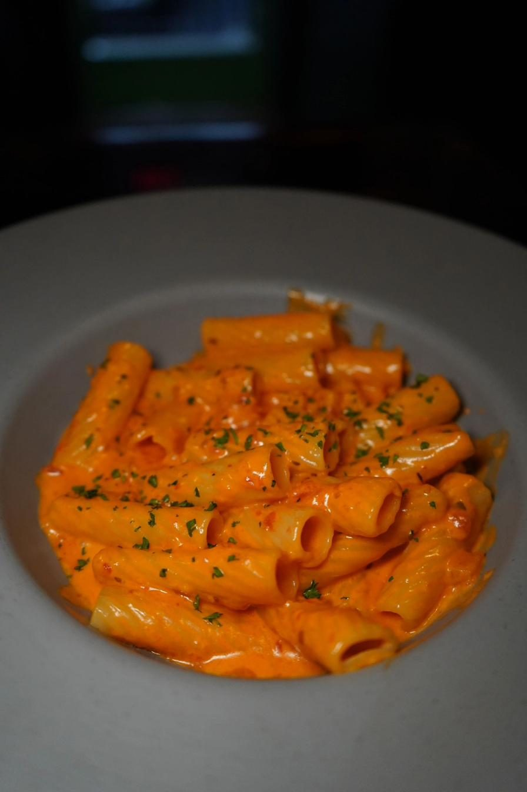

# The Usual Suspects — Website

A complete, upload-ready website for The Usual Suspects (Raritan, NJ).
This guide is written for non-developers.

---

## What's in this folder

```
usual-suspects/
├── index.html       ← The main page (this is the one you edit)
├── style.css        ← All the visual styling (don't touch unless redesigning)
├── script.js        ← Interactive bits (mobile menu, gallery scroll)
├── .htaccess        ← Security + speed config (don't edit)
├── favicon.svg      ← The little icon in browser tabs
├── robots.txt       ← Tells Google what to crawl
├── sitemap.xml      ← Map of the site for Google
├── README.md        ← This file
└── images/          ← All photos used on the site
    ├── hero.jpg
    ├── logo.jpg
    ├── vogue-ceiling.jpg
    ├── heart-cake.jpg
    ├── rose-wall.jpg
    ├── draft-beer.jpg
    ├── exterior.jpg
    ├── espresso-martini.jpg
    ├── front-door.jpg
    ├── vodka-rigatoni.jpg
    ├── chicken-parm.jpg
    ├── meatballs.jpg
    ├── calamari.jpg
    └── private-room.jpg
```

---

## How to upload the site (first-time setup)

### Option A: GoDaddy / Hostinger / Namecheap (shared hosting)

1. Log into your hosting control panel (cPanel, Plesk, or similar).
2. Open **File Manager** (usually under "Files").
3. Navigate to `public_html/` (or `www/` — it's the folder whose contents become your website).
4. **Delete everything inside** that folder if it's a fresh site, or back it up if you're replacing an existing site.
5. Upload the **contents** of this folder (not the folder itself — everything inside `usual-suspects/`).
6. Done. Visit `yourdomain.com` and the site is live.

### Option B: Via FTP (FileZilla)

1. Get your FTP credentials from your host (username, password, server address).
2. Open FileZilla, connect.
3. Drag the contents of `usual-suspects/` into `public_html/` on the server.
4. Done.

### Option C: Free hosting (Netlify / Cloudflare Pages)

1. Zip the entire `usual-suspects/` folder.
2. Go to [netlify.com/drop](https://app.netlify.com/drop) and drag the zip in.
3. You get a free URL instantly. Point your GoDaddy domain at it later if you want.

---

## How to update things later

### Change menu prices or dishes

1. Open `index.html` in **Notepad** (Windows) or **TextEdit** (Mac).
2. Press **Ctrl+F** (Mac: Cmd+F) and search for: `MENU ITEMS`
3. Each dish is a block that looks like this:

   ```html
   <article class="dish-card s1 reveal">
     <span class="price">$22</span>
     
     <div class="info">
       <div class="n">The 'Oss</div>
       <div class="d">rigatoni alla vodka — the house</div>
     </div>
   </article>
   ```

   - Change `$22` to update the price.
   - Change `The 'Oss` to rename the dish.
   - Change the cursive tagline in `<div class="d">`.
4. Save the file, re-upload it to your host. Done.

### Change the hours

1. Open `index.html`.
2. Search for: `HOURS`
3. Edit the line that looks like:
   `Tue–Thu 12–10 · Fri–Sat 12–12 · Sun 12–10 · Closed Mondays`
4. Also update the structured data block at the top of the file (search for `openingHoursSpecification`) so Google sees the right hours.
5. Save, upload. Done.

### Change phone number or email

1. Open `index.html`.
2. Search for: `CONTACT INFO`
3. You'll find three spots — update them all (they should match).
4. Also update the phone in the structured data block near the top (search for `telephone`).

### Change weekly events

1. Open `index.html`.
2. Search for: `WEEKLY EVENTS`
3. Edit the four `<article class="promo ...">` blocks — change the day, title, subtitle, and footer text.

### Swap any photo

1. Find a new photo. Make it a JPEG, under 2 MB, around 1200–1600 pixels wide.
2. Rename it to **exactly** match the filename you're replacing (e.g. `vodka-rigatoni.jpg`).
3. Drag it into the `images/` folder, overwriting the old one.
4. Re-upload just that image to your host. Done.

### Change the business address

1. Open `index.html`.
2. Search for: `46 Thompson`
3. Update every place it appears (footer, location section, structured data, and the Google Maps link).

---

## Security recommendations

**1. Enable Cloudflare (free, 10 minutes).** This puts a security layer in front of your site — blocks DDoS attacks, hides your origin server, speeds up the site worldwide.

- Sign up at [cloudflare.com](https://www.cloudflare.com).
- Add your domain.
- Update your domain's nameservers (Cloudflare tells you exactly which ones).
- Wait 24 hours for DNS to propagate.
- In the Cloudflare dashboard, turn on: *Always Use HTTPS*, *Auto Minify (HTML/CSS/JS)*, *Brotli compression*, and the free *Security Level: Medium* setting.

**2. Use strong passwords on your hosting account.** The most common "hack" on small-business sites is not a technical exploit — it's someone guessing a weak password on the hosting control panel.

**3. Keep your domain registrar account secured with 2FA.** If someone steals your domain, they steal your site.

**4. The `.htaccess` file already handles** forcing HTTPS, preventing clickjacking, blocking MIME-sniffing attacks, and setting a strict Content Security Policy. Don't edit it unless you know what you're doing.

---

## SEO recommendations

**1. Claim your Google Business Profile.** This is the single biggest SEO win for a local bar — more important than the website itself. Go to [business.google.com](https://business.google.com) and claim "The Usual Suspects" at 46 Thompson St, Raritan NJ. Add photos, hours, menu link.

**2. Submit your sitemap to Google.** Go to [Google Search Console](https://search.google.com/search-console), add your site, verify ownership (the easiest way is DNS TXT record), and submit `https://yourdomain.com/sitemap.xml`.

**3. Get listed consistently.** Your Name/Address/Phone should be **identical** on Google, Yelp, TripAdvisor, Facebook, Instagram, and every other directory. Inconsistencies hurt local rankings.

**4. Encourage real reviews.** Google reviews are the #2 ranking factor for local businesses after proximity.

---

## Questions?

This site is built to be as simple and durable as possible. No frameworks,
no dependencies, no build step. You can edit it in Notepad in 2032 and
it will still work exactly the same way.

If something breaks after you edit, the safest move is to re-upload
the original file from this package.
